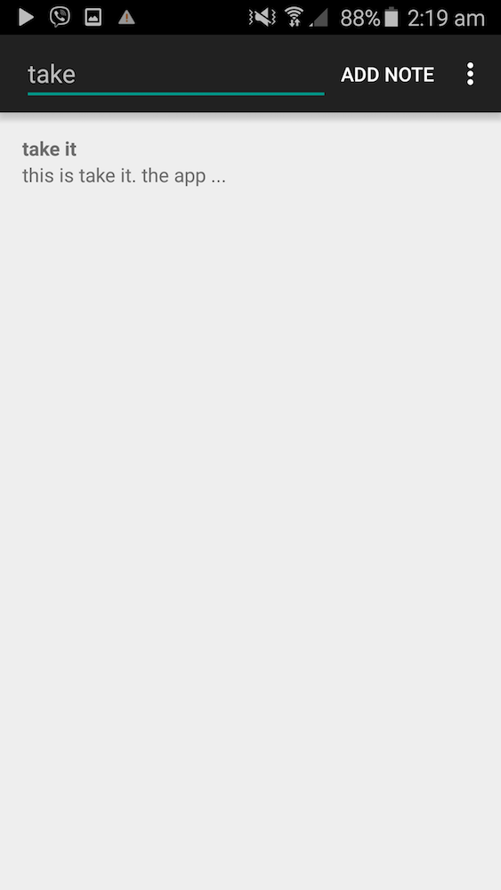
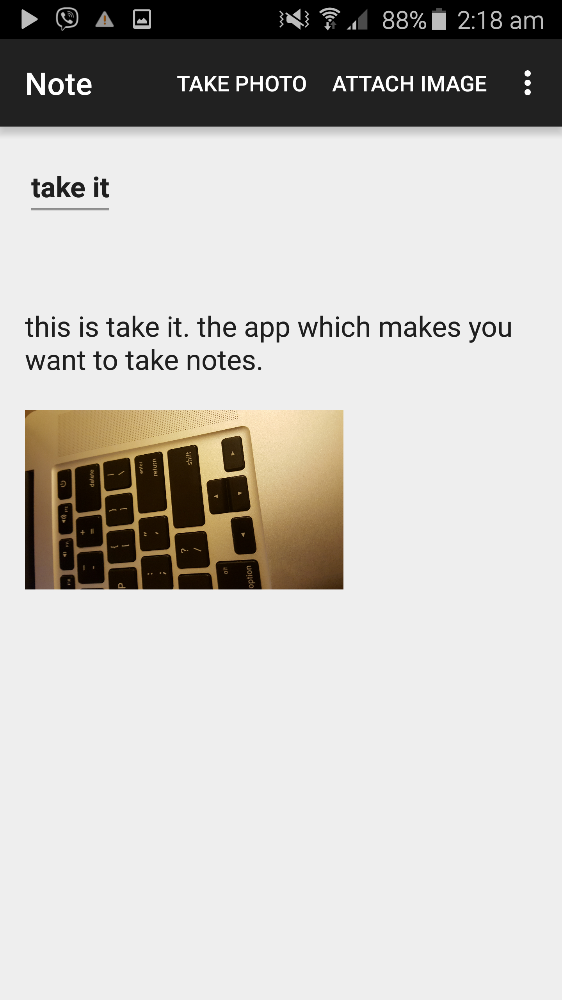

# TakeIT
## An app which takes care of all your notes

### What is TakeIt

TakeIt is a note-taking app for android platform which lets you take care of
all your notes.

Using TakeIt, you can write text notes, edit them, take picture notes and
organise your notes.

### Design

The TakeIt app consists of 3 main classess to handle the different tasks. In
what follows, we will explain the abstract design of the app.

1. Home: Home class is associated with our homescreen. Homescreen id the first activity which will be open when we open the app. Homescreen contains a list which contains all the notes by default. It also lets us search through our notes. It will also let us to choose a note, view, edit or delete it.

2. Note: This class takes care of storing and fetching all the fields in a note in addition to
letting us add, modify and delete our notes. Using this class we can also attach the existing photos or take new photos and attach them to our notes.

3. DBHelper: This class contains all the required queries and scripts to create, maintain and query from our SQLite database. This class will be instantiated in both our Home and Note class and we use it for all our queries and data modifications.

### Features

0. Take, edit, delete notes
1. Search for the notes whose titles or bodies contain a certain keyword.
2. Supports landscape and portrait mode.
3. Attaching existing images to the notes.
4. Taking photos using phone's camera and attach it to the notes.
5. Share your notes through facebook, email, etc.
6. Clicking and looking at the available options for each note.
7. Speech recognition

### Testing Summary

The three main classes are application are tested using JUnit, AndroidTestCase and ActivityInstrumentationTest2.

The Database queries and statements are all tested seperately in the DBHelperTest. Since database is the only data repository of our app, validating it let us to test the rest of our application as a blackbox.

The integration tests were done by testing are two main activities 'Note' and 'Home'.

For the Home class, our tests mostly focused on the functionality of our listview and in particular its real-time updates with the alternation of data. Different operations were done and the functionality of our main ListView is tested. Some operations such as invoking the "Note" activity was not tested using Junit, but tested by dozens of users due to UX issues and getting actual feedback.

For the Note class, a major part of the test was done by asking actual users for feedbacks. However, the functionality of the backbutton and the save method is fully tested.

Visual and Auditory features of our app such as inserting images, using the camera and speech recognition are all tested from the UI due to their nature.
