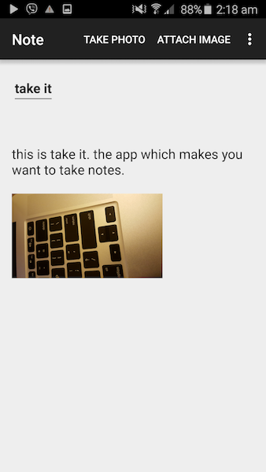

# MyDiary
## An app which takes care of all your notes

### What is MyDiary

MyDiary is a note-taking app for android platform which lets you take care of
all your notes.

Using MyDiary, you can write text notes, edit them, take picture notes and
organise your notes.

### Design

The MyDiary app consists of 3 main classess to handle the different tasks. In
what follows, we will explain the abstract design of our MyDiary app.

1. Home: Home class is associated with our homescreen. Homescreen id the first activity which will be open when we open the app. Homescreen contains a list which contains all the notes by default. It also lets us search through our notes. It will also let us to choose a note, view, edit or delete it.

2. Note: This class takes care of storing and fetching all the fields in a note in addition to
letting us add, modify and delete our notes. Using this class we can also attach the existing photos or take new photos and attach them to our notes.

3. DBHelper: This class contains all the required queries and scripts to create, maintain and query from our SQLite database. This class will be instantiated in both our Home and Note class and we use it for all our queries and data modifications.

### Features

0. Take, edit, delete notes
1. Search for the notes whose titles or bodies contain a certain keyword.
2. Supports landscape and portrait mode.
3. Attaching existing images to the notes.
4. Taking photos using phone's camera and attach it to the notes.
5. Share your notes through facebook, email, etc.
6. Clicking and looking at the available options for each note.